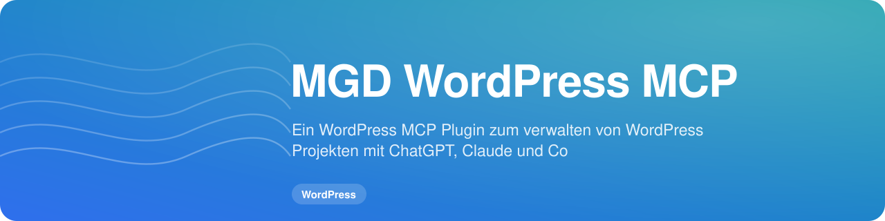

<!-- MGD-HEADER -->
<p align="center"><a href="https://Michael-Gahn.de"></a></p>

<p align="center"></p>

<p align="center">
  
  <a href="https://github.com/MichaelGahnDESIGN/MGD_WordPress-MCP/releases/latest"></a>
  
  <a href="https://Michael-Gahn.de"></a>
</p>
<!-- /MGD-HEADER -->

# MGD WordPress MCP

**WordPress trifft KI. Sicher, verständlich und kontrollierbar.**

MGD WordPress MCP verbindet WordPress mit MCP-kompatiblen KI-Agenten wie Claude Code, OpenAI Codex und anderen MCP-Clients. Das Plugin stellt klar begrenzte WordPress-Abilities für Inhalte, Medien, SEO, Divi 5, WPForms, UpdraftPlus, Updates und die Website-Umgebung bereit.

## Aktueller Stand: 0.2.8

Der GitHub-basierte WordPress-Self-Updater ist seit dem Test **0.2.7 → 0.2.8 erfolgreich End-to-End verifiziert**. WordPress erkennt einen neuen GitHub Release selbstständig, zeigt Version, Icon, Versionsdetails und Kompatibilität an und kann das validierte Release-Paket über die normale WordPress-Updateoberfläche installieren.

Die entscheidende Updater-Härtung erfolgte in 0.2.7. Sie orientiert sich am bereits produktiv funktionierenden Updater von MGD AI Kennzeichnung WordPress und kombiniert den klassischen WordPress-Update-Transient mit der Update-URI-Integration. Ein veralteter Release-Cache wird nicht mehr weiterverwendet, wenn er keine neuere Version als die installierte Version enthält.

> **Projektstatus:** Installation, Admin-UI, Release-Build und Self-Update-Kette sind real getestet. Als nächste große Validierungsstufe folgen MCP Read-only, kontrollierter Schreibzugriff und die Integrationen auf einer realen Testwebsite. Die vollständige technische Checkliste steht in [`agent-readme.md`](agent-readme.md).

## Was das Plugin ermöglichen soll

Ein autorisierter Agent soll je nach Freigabe unter anderem Inhalte lesen und bearbeiten, Medien verwalten, SEO-Metadaten pflegen, Divi-5-Inhalte kontrolliert ändern, WPForms verwenden, UpdraftPlus-Backups anstoßen und einzelne Plugin- oder Theme-Updates durchführen können.

MGD WordPress MCP ist dabei bewusst keine unbeschränkte Remote-Administration. WordPress-Capabilities, zusätzliche Plugin-Freigaben, Bestätigungstoken und Auditierung bilden mehrere Schutzschichten.

## Privacy by Default

Die Admin-Oberfläche benötigt für ihre Darstellung keine externen UI-Ressourcen. Es werden keine Google Fonts, Font-CDNs, Icon-CDNs, JavaScript-CDNs oder extern eingebetteten Bilder geladen. Schrift wird über den lokalen System-/WordPress-Fontstack dargestellt. Plugin-Icon und Headergrafik liegen im Plugin selbst.

Externe Ziele wie GitHub, Wiki oder Michael-Gahn.de werden erst nach einem bewussten Klick geöffnet. Die optionale GitHub-Release-Prüfung für Updates ist eine funktionale Server-zu-Server-Abfrage und kann deaktiviert werden.

Das Plugin enthält keine Telemetrie, keine Werbung und kein Tracking.

## Sicherheitsmodell

Schreibzugriffe sind nach der Installation standardmäßig deaktiviert. Divi-Schreibzugriff, externe Medienimporte und Wartungsaktionen besitzen zusätzliche Freigaben. WordPress-Benutzerrechte bleiben maßgeblich.

Inhalte werden über das Content-Tool nicht endgültig gelöscht, sondern in den Papierkorb verschoben. Riskantere Aktionen benötigen zusätzliche Bestätigung. Agenten-Aktionen können lokal im Audit-Log nachvollzogen werden.

Der direkte Base64-Medienupload bleibt fail-closed deaktiviert, bis tatsächlicher Dateityp, Dateiendung und MIME-Typ ausreichend gehärtet gegeneinander validiert werden können.

## Funktionsstand

| Bereich | Stand |
|---|---|
| Installation / Aktivierung | real getestet |
| Admin-Oberfläche | real auf WordPress 7.1 getestet |
| WordPress Self-Updates | **End-to-End erfolgreich getestet** |
| GitHub Release ZIP | automatischer Build erfolgreich getestet |
| Abilities API | erkannt |
| offizieller MCP Adapter | erkannt |
| HTTPS | erkannt |
| Builder-Erkennung | Divi 5 real erkannt; weitere Builder implementiert |
| WordPress Inhalte | implementiert, MCP-End-to-End-Test offen |
| Mediathek / Beitragsbild | implementiert, Base64-Direktupload deaktiviert |
| Rank Math / Yoast | implementiert, Praxistest offen |
| Divi 5 | konservative Integration implementiert, Schreibtest offen |
| WPForms | Bridge implementiert, Praxistest offen |
| UpdraftPlus | Backup-Trigger implementiert, Praxistest offen |
| Plugin-/Theme-Wartung | Einzelupdates mit Freigabe implementiert, MCP-Test offen |
| Frontend-Schutz | heuristische Erkennung implementiert und auf Testseite ausgelöst |
| Audit-Log | implementiert |

## Voraussetzungen

* WordPress 6.9 oder neuer
* PHP 7.4 oder neuer
* HTTPS für Remote-MCP-Verbindungen
* offizieller WordPress MCP Adapter
* für Remote-Zugriff ein geeigneter WordPress-Benutzer und ein separates Application Password

## Installation

1. Öffne den neuesten GitHub Release.
2. Lade ausschließlich `mgd-wordpress-mcp.zip` herunter.
3. Öffne in WordPress **Plugins → Plugin hinzufügen → Plugin hochladen**.
4. Installiere und aktiviere das Plugin.
5. Folge dem Einrichtungs-Assistenten.
6. Prüfe MCP Adapter, Builder und Sicherheitsfreigaben.
7. Erstelle für den MCP-Client ein separates Application Password.

Nach erfolgreicher Erstinstallation können spätere Releases direkt über die normale WordPress-Updateoberfläche angeboten werden.

Offizieller WordPress MCP Adapter: https://github.com/WordPress/mcp-adapter

## MCP-Endpunkt

Der Endpoint folgt diesem Schema:

```text
https://DEINE-DOMAIN.TLD/wp-json/mgd-wordpress-mcp/v1/mcp
```

Für Remote-Zugriffe sollte ein separater WordPress-Benutzer mit minimal erforderlichen Rechten verwendet werden. Das Application Password gehört ausschließlich in den Secret-/Environment-Speicher des jeweiligen MCP-Clients. Zugangsdaten dürfen nicht in Chats, GitHub-Repositories, Skills, Screenshots oder Dokumentationen gespeichert werden.

## Einrichtungs-Assistent

Der Assistent erkennt die WordPress-Umgebung und unterstützt bei der Auswahl des bevorzugten Builders. Divi 5, Elementor, Gutenberg, Bricks und Beaver Builder werden berücksichtigt. Ein anderes System kann manuell angegeben werden.

Bei Divi 5 empfiehlt der Assistent zusätzlich den MGD Divi 5 Dev Skill. Ein WordPress-Plugin installiert diesen Skill nicht ungefragt auf dem lokalen Computer.

Der Assistent zeigt außerdem den MCP-Endpunkt und Hinweise zu Application Passwords, Schreibfreigaben und möglichem Frontend-Schutz.

## Divi 5

Für Divi-Projekte empfiehlt das Plugin zusätzlich den kostenlosen **MGD Divi 5 Dev Skill**:
https://github.com/MichaelGahnDESIGN/MGD_Divi5-Dev_SKILL

Der Skill liefert Agenten Divi-spezifisches Wissen und Arbeitsregeln. MGD WordPress MCP stellt die kontrollierte WordPress-Werkzeugschicht bereit.

Divi-Schreiboperationen sind separat freizugeben. Vor vorgesehenen Raw-Layout-Änderungen werden WordPress-Revisionen berücksichtigt. Die reale Layout-Integritätsprüfung im Visual Builder gehört zur nächsten Testphase.

## Frontend-Sperren

MGD WordPress MCP erkennt typische aktive Shield-, Passwort-, Restricted-Access-, Maintenance- und Coming-Soon-Plugins heuristisch.

Wird eine visuelle Prüfung tatsächlich blockiert, soll ein Agent den autorisierten Benutzer nach dem legitimen Entsperrweg oder einer temporären Freigabe fragen. Das Plugin implementiert keine Funktion zum Umgehen solcher Schutzmechanismen. PINs und Passwörter werden nicht als Plugin-Konfiguration oder Audit-Daten gespeichert.

## WordPress Self-Updates

MGD WordPress MCP prüft optional den neuesten stabilen GitHub Release dieses Repositorys. Als Updatepaket wird ausschließlich ein Release-Asset akzeptiert, das den erwarteten Repository-Pfad, GitHub als Downloadhost und den exakten Namen

```text
mgd-wordpress-mcp.zip
```

besitzt.

### Erfolgreich verifizierter Test

Am 15. September 2026 wurde die vollständige Updatekette real getestet:

```text
MGD WordPress MCP 0.2.7 installiert
        ↓
GitHub Release v0.2.8 veröffentlicht
        ↓
GitHub Actions erzeugt mgd-wordpress-mcp.zip
        ↓
WordPress → Dashboard → Aktualisierungen → Erneut überprüfen
        ↓
WordPress erkennt MGD WordPress MCP 0.2.8 automatisch
```

WordPress zeigte dabei die installierte Version 0.2.7, die verfügbare Version 0.2.8, das lokale Plugin-Icon, den Link zu den Versionsdetails sowie die Kompatibilitätsinformation für WordPress 7.1 korrekt an.

### Warum frühere Versuche scheiterten

Die frühen 0.2.x-Versionen enthielten zwei Probleme. Zunächst wurde zu stark auf den Zustand des WordPress-Update-Transients vertraut. Später konnte ein mehrere Stunden gültiger GitHub-Release-Cache einen gerade neu veröffentlichten Release verdecken.

Seit 0.2.7 wird ein Cache erneut geprüft, sobald dessen Release-Version nicht neuer als die lokal installierte Version ist. Der klassische WordPress-Update-Transient wird als kompatibler Pfad verwendet; die Update-URI-Integration bleibt ergänzend vorhanden.

## Release-Prozess

Ein Release-Tag folgt dem Schema `vX.Y.Z`. Plugin-Version und `Stable tag` müssen dazu passen.

Der GitHub-Workflow prüft die Release-Metadaten und PHP-Syntax und erzeugt anschließend das installierbare Asset `mgd-wordpress-mcp.zip` mit stabilem Plugin-Ordner. Source-Code-ZIPs von GitHub sind nicht das definierte Updatepaket.

## Qualitätssicherung

CI prüft PHP 7.4, 8.1, 8.3 und 8.4. Das Plugin wurde zusätzlich real mit WordPress 7.1 und PHP 8.5.x betrieben. Auf dieser Testinstallation wurden Abilities API, offizieller MCP Adapter, HTTPS und Divi 5 erkannt.

Der Self-Updater ist real verifiziert. MCP Read-/Write- und Integrationsprüfungen sind die nächste Teststufe und werden transparent in `agent-readme.md` geführt.

## Dokumentation

Die ausführliche Dokumentation liegt im Ordner [`wiki/`](wiki/).

* [Wiki Home](wiki/Home.md)
* [Installation und Voraussetzungen](wiki/Installation-und-Voraussetzungen.md)
* [Einrichtungs-Assistent](wiki/Einrichtungs-Assistent.md)
* [MCP und Architektur](wiki/MCP-und-Architektur.md)
* [Sicherheit und Berechtigungen](wiki/Sicherheit-und-Berechtigungen.md)
* [Divi 5 Integration](wiki/Divi-5-Integration.md)
* [Builder und Agent Skills](wiki/Builder-und-Agent-Skills.md)
* [Frontend-Sperren und Zugang](wiki/Frontend-Sperren-und-Zugang.md)
* [WPForms Integration](wiki/WPForms-Integration.md)
* [UpdraftPlus und Backups](wiki/UpdraftPlus-und-Backups.md)
* [SEO mit Rank Math und Yoast](wiki/SEO-Rank-Math-und-Yoast.md)
* [Updates und Wartung](wiki/Updates-und-Wartung.md)
* [Datenschutz und Rechtliches](wiki/Datenschutz-und-Rechtliches.md)
* [Fehlerbehebung](wiki/Fehlerbehebung.md)
* [Roadmap](wiki/Roadmap.md)
* [Agenten-/Entwicklercheckliste](agent-readme.md)

## Passende MGD-Projekte

* MGD Divi 5 Dev Skill: https://github.com/MichaelGahnDESIGN/MGD_Divi5-Dev_SKILL
* MGD AI Kennzeichnung WordPress: https://github.com/MichaelGahnDESIGN/MGD-AI-Kennzeichnung-WordPress
* MGD Blogpost Skill: https://github.com/MichaelGahnDESIGN/MGD_Blogpost-Skill

## Lizenz

**GPL-2.0-or-later**. Siehe [`LICENSE`](LICENSE).

## Sicherheit

Sicherheitslücken bitte nicht als öffentliches Issue mit Exploitdetails veröffentlichen. Siehe [`SECURITY.md`](SECURITY.md) und [`SECURITY-AUDIT.md`](SECURITY-AUDIT.md).

## Impressum gemäß § 5 DDG

**Michael Gahn DESIGN**  
Inhaber: Michael Gahn  
Dr.-Theodor-Brugsch-Str. 12  
08529 Plauen  
Deutschland

Telefon: +49 (0) 151 59156639  
E-Mail: Anfrage@Michael-Gahn.de  
Website: https://Michael-Gahn.de

Umsatzsteuer-Identifikationsnummer gemäß § 27a Umsatzsteuergesetz: **DE288143343**  
Steuernummer: **223/222/02451**

Die Anbieterkennzeichnung steht zusätzlich vollständig in [`IMPRESSUM.md`](IMPRESSUM.md).

---

**MGD WordPress MCP** ist ein Open-Source-Projekt von Michael Gahn DESIGN. Ziel ist eine leistungsfähige WordPress-Schnittstelle für moderne KI-Agenten, ohne Kontrolle, Datenschutz und Nachvollziehbarkeit aufzugeben.

<!-- MGD-LEGAL -->
---

## Lizenz

Dieses Projekt steht unter der [GNU GPL v2 oder neuer](https://www.gnu.org/licenses/old-licenses/gpl-2.0.html). Den vollständigen Text enthält die Datei [LICENSE](LICENSE).

## Impressum

**Angaben gemäß § 5 DDG (Digitale-Dienste-Gesetz)**

Michael Gahn DESIGN  
Michael Gahn  
Dr.-Theodor-Brugsch Str. 12  
08529 Plauen  
Sachsen  
Deutschland

Tel.: +49 (0) 151 59156639  
E-Mail: Anfrage@Michael-Gahn.de

Umsatzsteuer-Identifikationsnummer gemäß § 27 a Umsatzsteuergesetz:  
Steuernummer: 223/222/02451  
Ust-ID: DE288143343

Wir sind zur Teilnahme an einem Streitbeilegungsverfahren vor einer Verbraucherschlichtungsstelle weder verpflichtet noch bereit.

**Redaktionell verantwortlich:**

Michael Gahn DESIGN  
Michael Gahn  
Dr.-Theodor-Brugsch Str. 12  
08529 Plauen  
Sachsen  
Deutschland

Tel.: +49 (0) 151 59156639  
E-Mail: Anfrage@Michael-Gahn.de
<!-- /MGD-LEGAL -->
